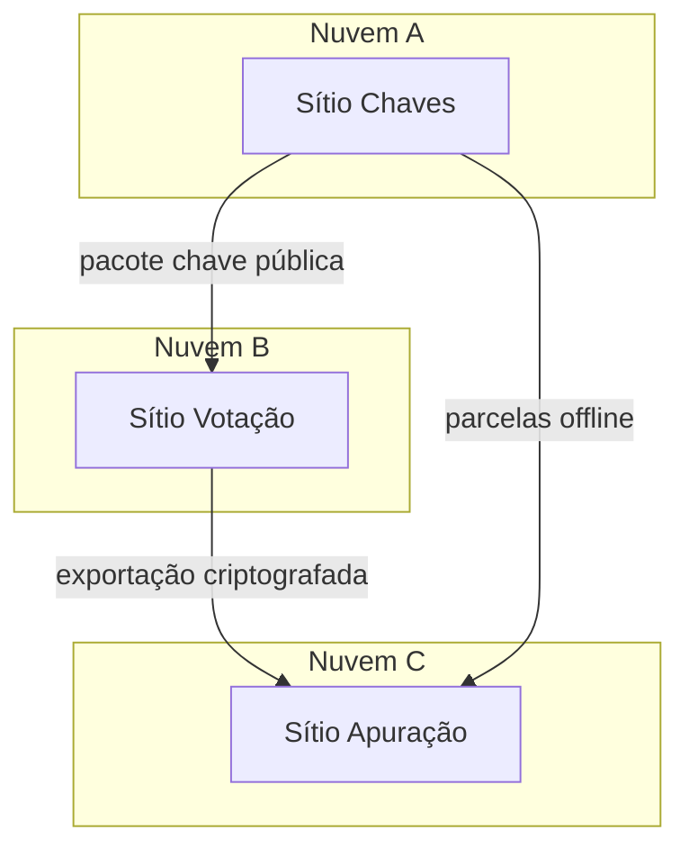

# Implantação E3 — um cliente, três sítios

> **Standalone HTTP (caminho actual):** [`../piloto-3-nos.md`](../piloto-3-nos.md), [`../activar-standalone.md`](../activar-standalone.md).  
> O modelo E3 abaixo permanece válido; a activação já **não** passa por CMS.

Modelo essencial RelataSoft: **1 cliente = 3 sítios**, preferencialmente em **nuvens distintas**.

## Sítios

1. **Autoridade de chaves** — gera ElGamal + parcelas Shamir
2. **Plataforma de votação** — urnas criptografadas e cadastro
3. **Apuração / certificação** — importa material, reconstrói segredo, certifica

## Isolamento

- **Sem sincronização automática** de usuários, opções ou mídia entre sítios
- Contas de **Gestor pelo Cliente** podem compartilhar o mesmo login/senha *inicial* por conveniência operacional, mas são identidades **isoladas** em cada base de dados
- Transporte de material (chaves públicas, exportações de votos, parcelas) é **manual e auditável**

Nunca compartilhar a chave privada completa entre sítios de votação.

## Piloto sem host legado (A6)

O Adapter #2 (`Standalone`) reproduz esta topologia com três processos/pastas e um **courier** de ficheiros — ver `docs/piloto-adapter2-3-nos.md` e `php bin/ve-node pilot`.
