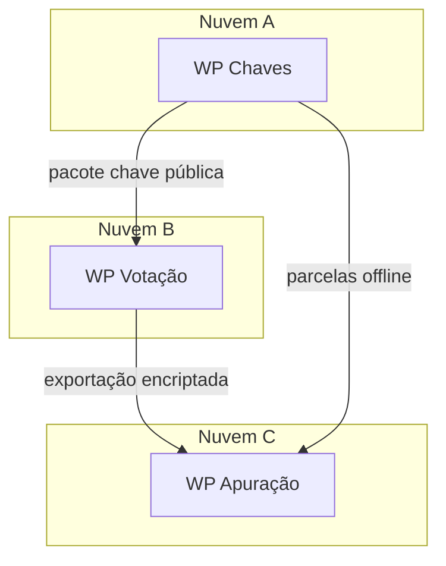

# Implantação E3 — um cliente, três WordPress

Modelo essencial RelataSoft: **1 cliente = 3 instalações WordPress**, preferencialmente em **nuvens distintas**.

## Sítios

1. **Autoridade de chaves** — gera ElGamal + parcelas Shamir
2. **Plataforma de votação** — urnas encriptadas e cadastro
3. **Apuração / certificação** — importa material, reconstrói segredo, certifica

## Isolamento

- **Sem sincronização automática** de utilizadores, opções ou media entre sítios
- Contas de **Gestor pelo Cliente** podem partilhar o mesmo login/senha *inicial* por conveniência operacional, mas são identidades **isoladas** em cada base de dados
- Transporte de material (chaves públicas, exportações de votos, parcelas) é **manual e auditável**

Nunca partilhe a chave privada completa entre sítios de votação.
