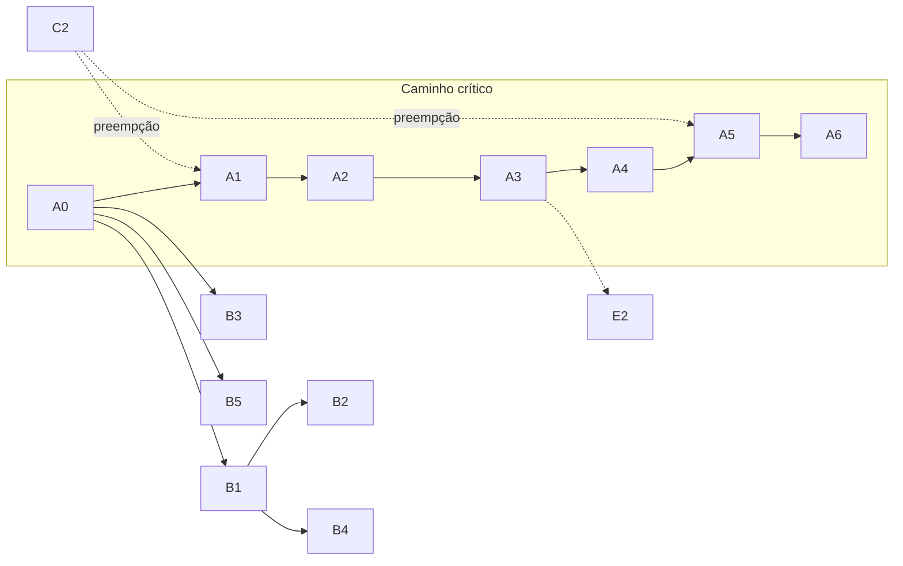

# Roadmap — Independência do adapter (cronograma estilo PMBOK)

**Produto:** Voto Eletrônico by RelataSoft / Painel de Controle Eleitoral  
**Objetivo do projeto:** tornar o domínio eleitoral e o Painel **independentes do sítio hospedeiro atual**, mantendo o host vigente como **Adapter #1** até existir Adapter #2 (ou saída controlada).  
**Restrição de segurança:** 1 cliente = **3 sítios isolados** (chaves / votação / apuração); sem sincronização automática entre sítios.  
**Documento de apoio:** `architecture.md`, `conhecimento/implantacao-3wp.md`, `glossary-pt.md`.

> **Nota de escala temporal:** as durações usam **UE (unidade de esforço relativo)** — tamanho comparativo de trabalho, **não** dias de calendário. O caminho crítico e a gestão CPM funcionam com UE; a conversão para calendário fica a cargo do PM com a capacidade real da equipa.

---

## 1. Integração com o PMBOK (mapa rápido)

| Área de conhecimento PMBOK | Como aparece neste roadmap |
|----------------------------|----------------------------|
| Escopo | EAP/WBS (§2), exclusões (§2.3) |
| Cronograma | Atividades, predecessores, CPM (§3–§5) |
| Caminho crítico | Identificação + gestão contínua (§5–§6) |
| Custo / recursos | UE e paralelismo (§3.2, §6.3) |
| Qualidade | Portões (gates) por fase (§4) |
| Riscos | Registo e resposta (§7) |
| Stakeholders | Operadores, P&D, futuros hosts (§8) |
| Integração / mudanças | Controlo de baseline do caminho crítico (§6.4) |
| Aquisições | Fora de escopo (host próprio ou adapter interno) |

**Grupos de processos:** Iniciação (A0) → Planeamento (este doc) → Execução (A1–A6 / B / C) → Monitoramento (CPM + gates) → Encerramento (piloto A6 + lições aprendidas).

---

## 2. EAP / WBS (escopo)

```text
1. Independência do adapter
├── 1.1 Fundação de produto e linguagem          (A0)
├── 1.2 Núcleo portável (crypto + formatos)      (A1)
├── 1.3 Portas de persistência                   (A2)
├── 1.4 Identidade e segredos                    (A3)
├── 1.5 Jobs e transporte                        (A4)
├── 1.6 Apresentação (Painel + jornada)          (A5)
└── 1.7 Segundo adapter / saída do host legado   (A6)

2. Produto eleitoral no Adapter #1 (paralelo)
├── 2.1 Cadastro Eleitoral + .rsv                (B1)
├── 2.2 Auditor + estatísticas                   (B2)
├── 2.3 Conhecimento + E3                        (B3)
├── 2.4 Áudio / alertas                          (B4)
├── 2.5 Metadados de cliente (E1)                (B5)
└── 2.6 Hardening UX/copy                        (B6)

3. Operação e segurança (contínuo)
├── 3.1 Isolamento 3 sítios                      (C1)
├── 3.2 Máscara /painel e 404 clássico           (C2)
└── 3.3 Becape, módulos, autoteste crypto        (C3)

4. Backlog explícito (fora do caminho crítico atual)
└── 4.1 Orquestrador / vendas / pagamentos (E2)
```

### 2.1 Entrega principal (1.x)

Produto capaz de correr o domínio eleitoral atrás de **contratos (ports)**, com o sítio atual apenas como uma implementação de adapter — e, no fim, um **piloto** sem o host legado.

### 2.2 Entregas paralelas (2.x / 3.x)

Valor de negócio contínuo no Adapter #1 e higiene operacional, **sem** esperar A6.

### 2.3 Exclusões (não fazer neste projeto)

- Reescrita greenfield de ElGamal / Shamir / tally  
- Sync automático de utilizadores entre os 3 sítios  
- Orquestrador multi-cliente com billing (E2) — pacote 4.1  
- Nomear a marca do host na UI ou no Conhecimento orientado a operador  

---

## 3. Dicionário de atividades (rede)

**Legenda de predecessores:** FS = Finish-to-Start (padrão).  
**UE:** esforço relativo (1 = pequeno; 8 = grande).

### 3.1 Pacote 1 — Independência (série crítica principal)

| ID | Atividade | Pred. | UE | Entregável / gate |
|----|-----------|-------|---:|-------------------|
| A0 | Congelar glossário sítio/Painel/adapter; documentar fachada `/painel` vs motor | — | 2 | Copy + Conhecimento alinhados |
| A1 | Extrair biblioteca crypto + formatos (`.rsv`, pacotes, hashes); testes sem boot do sítio | A0 | 5 | Pacote PHP puro + CI verde |
| A2 | Definir ports de repositório (keys, elections, votes, tallies, audit) + impl. Adapter #1 | A1 | 6 | Serviços sem `$wpdb` directo |
| A3 | Ports de identidade/capacidade/sessão + key provider (sair dos sais do host) | A2 | 8 | RSV/autoridades/cast só via ports |
| A4 | Abstrair jobs (keygen, import/export RSV) fora de option+ajax como API de domínio | A3 | 5 | Contratos de job + cliente UI |
| A5 | Rotas/UI próprias (jornada + shell Painel); shortcodes viram adaptadores finos ou morrem | A4 | 8 | Itinerário sem shortcode obrigatório |
| A6 | Adapter #2 **ou** saída do host; piloto 3 sítios isolados | A5 | 8 | Cliente piloto sem host legado |

### 3.2 Pacote 2 — Produto no Adapter #1 (paralelo ao crítico)

| ID | Atividade | Pred. | UE | Notas |
|----|-----------|-------|---:|-------|
| B1 | Cadastro Eleitoral unificado + `.rsv` | A0 | 6 | Pode avançar em paralelo a A1–A2 |
| B2 | Papel Auditor + stats de votação | B1 | 3 | |
| B3 | Conhecimento + doc E3 | A0 | 2 | Paralelo a B1 |
| B4 | Áudio fim de turno + beep export | B1 | 2 | |
| B5 | E1 `cliente_id` / `cliente_nome` | A0 | 1 | |
| B6 | Hardening PT-BR / sítio / UX | contínuo | 2 | Não no caminho crítico |

### 3.3 Pacote 3 — Operação (não negociável; pode preempção)

| ID | Atividade | Pred. | UE | Notas |
|----|-----------|-------|---:|-------|
| C1 | Garantir isolamento 3 sítios (ops + docs) | — | 2 | Prioridade se regressão |
| C2 | Máscara `/painel` + 404 clássico estável | — | 3 | Pode interromper B/A se quebrar |
| C3 | Becape / módulos ZIP / autoteste | — | 2 | Contínuo |

### 3.4 Pacote 4 — Backlog

| ID | Atividade | Pred. | UE |
|----|-----------|-------|---:|
| E2 | Orquestrador (vendas/pagamentos/multi-cliente) | A3 + B estável | TBD |

---

## 4. Marcos (milestones) e portões de qualidade

| Marco | Critério de aceitação (go) | No-go |
|-------|----------------------------|-------|
| **M0** — Linguagem | UI/docs sem nome do host; operadores usam `/id.php` + `/painel` | Copy ainda expõe o host |
| **M1** — Núcleo | Crypto/formatos em CI sem sítio | Testes só com boot do plugin |
| **M2** — Persistência | Trocar impl. de DB sem tocar crypto | Repos ainda acoplados a APIs do host |
| **M3** — Identidade | Provisionar papéis via portas | Caps/users ainda hardcoded ao host |
| **M4** — Jobs | Import/keygen via contratos | Domínio depende de `admin-ajax` |
| **M5** — UI | Eleitor completa itinerário sem shortcode | Jornada só em páginas do host |
| **M6** — Piloto | 3 nós de um cliente sem host legado | Sync, ou um único runtime “para simplificar” |

**Regra:** falha de marco ⇒ **não avançar de fase**; alargar testes/portas (gestão de caminho crítico, §6).

---

## 5. Caminho crítico (CPM)

### 5.1 Rede resumida (FS)

```text
                    ┌──► B3 ──► (folga)
                    │
A0 ──► A1 ──► A2 ──► A3 ──► A4 ──► A5 ──► A6     ← CAMINHO CRÍTICO
 │              │
 │              └──► (A3 também desbloqueia E2 no futuro)
 │
 ├──► B1 ──► B2
 │      └──► B4
 ├──► B5
 └──► B6 (contínuo)

C1 / C2 / C3 ──► podem preempção (interrupt) em qualquer ponto
```

### 5.2 Caminho crítico identificado

**CP = A0 → A1 → A2 → A3 → A4 → A5 → A6**

| Segmento | UE | Acumulado (UE) |
|----------|---:|---------------:|
| A0 | 2 | 2 |
| A1 | 5 | 7 |
| A2 | 6 | 13 |
| A3 | 8 | 21 |
| A4 | 5 | 26 |
| A5 | 8 | 34 |
| A6 | 8 | **42** |

**Duração crítica do programa de independência ≈ 42 UE** (escala relativa).

### 5.3 Folgas (float) — leitura prática

| Cadeia | UE acumulado (ordem) | Folga vs CP (42) | Interpretação |
|--------|----------------------:|-----------------:|---------------|
| CP (A0…A6) | 42 | 0 | Qualquer atraso atrasa o projeto de independência |
| B1→B2 (após A0; B1=6, B2=3) | ~11 a partir de A0 | Grande | Pode atrasar sem mover A6 **enquanto** não roubar recursos do CP |
| B3, B5 | Baixo | Grande | Bom para encher capacidade sem tocar no CP |
| C2 (máscara) | — | n/a | **Preempção:** se falhar, trata-se como crítico operacional |

### 5.4 Diagrama Mermaid (caminho crítico em destaque)



---

## 6. Gestão do caminho crítico

### 6.1 Princípios (PMBOK Schedule Management)

1. **Proteger o CP** — A1–A6 têm prioridade de pessoas seniores e de revisão.  
2. **Não “dourar” o CP** — scope creep em A3/A5 é a forma mais rápida de alongar os 42 UE.  
3. **Usar a folga de B*** para valor de negócio sem alongar A6.  
4. **Preempção de C*** — incidente de isolamento/máscara corta o CP até estabilizar (segurança > calendário de independência).  
5. **Baseline** — este documento é a baseline de rede; mudanças passam por §6.4.

### 6.2 Ritmo de monitorização

| Cadência | Acção |
|----------|--------|
| Cada incremento / PR relevante ao CP | Verificar se a atividade ainda é FS com o predecessor fechado (gate) |
| Fim de cada atividade A* | Actualizar “% concluído”, UE gasto vs UE planeado, risco residual |
| Ao falhar um gate (M1–M6) | Abrir acção correctiva **no mesmo nó** (não saltar para o sucessor) |
| Quando B* competir com A* | Decisão explícita: B só se CP tiver capacidade ociosa ou pessoa fora do CP |

### 6.3 Técnicas de compressão (se o CP precisar encolher)

| Técnica | Aplicação neste projeto | Custo / risco |
|---------|--------------------------|---------------|
| **Fast-tracking** | Sobrepor fim de A2 com início de contratos de A3 (rascunho de ports de identidade) | Retrabalho se A2 mudar schema |
| **Crashing** | Mais pessoas só em A3 ou A5 (nós mais longos, 8 UE) | Coordenação; não crashar A1 (núcleo crypto exige foco) |
| **Descopar** | Adiar partes de A5 (ex.: manter shortcode como adapter fino) | A6 mais cedo, mas dívida de apresentação |
| **Não comprimir** | A6 com piloto mínimo (1 cliente, 3 nós) | Reduz UE de A6 sem cortar A3 |

**Proibido como “compressão”:** sync entre sítios, fundir os 3 nós, saltar A3.

### 6.4 Controlo integrado de mudanças (baseline do CP)

Qualquer pedido que:

- adicione predecessor a um nó do CP, ou  
- aumente UE de A1–A6, ou  
- introduza dependência B→A no sentido que atraia o CP,

exige:

1. Impacto no acumulado de 42 UE  
2. Gate afectado (M1–M6)  
3. Decisão: aceitar (nova baseline) / rejeitar / adiar para pacote 2 ou 4  

### 6.5 Indicadores simples

| Indicador | Verde | Âmbar | Vermelho |
|-----------|-------|-------|----------|
| Folga do CP | 0 e gates a passar | Gate a falhar 1× | Gate a falhar 2× seguidas no mesmo nó |
| Roubo de recurso B→A | B só com capacidade livre | B a usar 1 pessoa do CP pontualmente | B a bloquear A3/A5 |
| Preempção C | 0 abertas | 1 incidente C em curso | Isolamento ou máscara quebrados em produção |

---

## 7. Riscos (registo resumido)

| ID | Risco | Impacto no CP | Resposta |
|----|-------|---------------|----------|
| R1 | Identidade (A3) mais invasiva que o estimado | Alonga o maior nó (8 UE) | Fast-track só de *interfaces*; impl. Adapter #1 primeiro |
| R2 | Partilhar pessoas do CP com B1 | Atraso em A2–A6 | Separar donos: “CP owner” ≠ “B owner” |
| R3 | Querer A6 sem A5 completo | Falso progresso | Gate M5 obrigatório |
| R4 | Regressão da máscara `/painel` | Preempção | C2 com smoke test em cada release |
| R5 | Reescrever crypto “já que estamos” | Explode UE e risco eleitoral | Exclusão explícita (§2.3) |
| R6 | E2 entrar cedo demais | Desvia A3 | E2 só após M3 + B estável |

---

## 8. Stakeholders e comunicação

| Stakeholder | Interesse | Mensagem-chave |
|-------------|-----------|----------------|
| Operadores eleitorais | Continuidade nos 3 sítios | Independência **não** muda o modelo 3 sítios isolados |
| P&D / arquitectura | Ports e testes | Adapter #1 permanece até M6 |
| Futuro orquestrador (E2) | Multi-cliente | Consome M3+; não é o CP actual |
| Segurança | Isolamento + máscara | C* pode parar o CP |

---

## 9. Dois cenários de execução (mesmo CP, ritmo diferente)

### 9.1 Conservador (recomendado)

1. Concluir valor B* útil no Adapter #1 com dono separado  
2. CP A1→A2 em fundo  
3. A3 quando identidade for o maior custo de mudança  
4. A5/A6 só com piloto e ops  

**Efeito no CP:** duração ≈ 42 UE; menor risco de retrabalho.

### 9.2 Agressivo (equipa dedicada ao núcleo)

1. A1 imediato  
2. A2+rascunho A3 em fast-track controlado  
3. Feature freeze no host legado durante A4–A5  
4. A6 em cliente **novo** (não migrar produção de uma vez)  

**Efeito no CP:** possível reduzir UE de calendário via crashing; **UE técnico do CP permanece ~42** salvo descopar A5.

---

## 10. Estado actual (baseline de progresso)

| Nó | Estado aproximado |
|----|-------------------|
| A0 | Em curso / avançado (glossário sítio; máscara documentada) |
| A1 | **Feito (gate M1)** — crypto/formatos em `src/Domain/Crypto` + `RsvFormat`/`AuthoritiesPackage`; PHPUnit sem boot do sítio; facades Adapter #1 em `includes/Crypto` |
| A2 | **Feito (gate M2)** — ports em `src/Contracts/{Keys,Elections,Votes,Tallies,Audit}`; InMemory + Adapter #1 em `src/Adapters/WordPress/Persistence`; `PersistenceGateway`; repositórios/serviços legados sem `$wpdb`/`Repository` directo nas operações de domínio |
| A3 | **Feito (gate M3)** — ports UserDirectory / CapabilityResolver / SessionPort / SecretKeyProvider; `IdentityGateway`; RSV, autoridades e cast via ports; `ShareEncryptionService` sem sais do host (só no adapter) |
| A4 | **Feito (gate M4)** — `JobStore` + `KeygenJobService` / `RsvImportJobService` / `RsvExportJobService` + `JobGateway`; estado de jobs sem `get_option` no domínio; AJAX vira adaptador fino |
| A5–A6 | Não iniciados como programa formal |
| B1–B6 | Parcialmente entregues no Adapter #1 |
| C1–C3 | Operacionais; manter |

**Próximo passo no caminho crítico:** iniciar **A5** (rotas/UI próprias; jornada sem shortcode obrigatório).

---

## 11. Referências internas

- `docs/architecture.md` — camadas Domain / Application / Adapters  
- `docs/conhecimento/implantacao-3wp.md` — E3, 3 sítios  
- `docs/wordpress-dependencies.md` — fachada `/painel` vs caminhos técnicos do motor  
- `docs/glossary-pt.md` — termos de produto  

---

*Baseline de rede CPM: versão inicial deste ficheiro. Actualizar a tabela §5.2 e o estado §10 a cada gate M\* concluído.*
